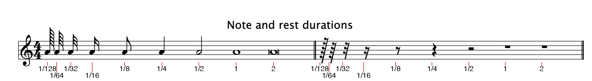

# Sheet music notation elements → code

A visual glossary of the notation elements Sheetmusic4J renders, so you can point at something in a screenshot and know
exactly which class/method is responsible for it. Rendered from
`fxdemo/src/test/resources/xmlsamples/SchbAvMaSample.musicxml`
(Schubert's *Ave Maria*), the same fixture used throughout development.


## How to use this when reporting a difference

Instead of "the horizontal line above the notes is too low", say **"the beam is too low"** — then check the table below
for `Beam` and you (or I)
can jump straight to `Engraver.computeStemTips` / `naturalStem`. The goal is to skip a round of "what do you mean by X"
every time something looks off.

## Element reference

Every element flows through the same three layers (see `CLAUDE.md`):
**MusicXML → core model → engraving layout → painter**. The table gives the concrete name at each stage.

| Element                          | What it looks like                                          | MusicXML source                                                             | Core model (`core`)                        | Layout (`engraving.Engraver`)                                                                     | Placement type                                         | Drawn by (`fxviewer.ScorePainter`) |
|----------------------------------|-------------------------------------------------------------|-----------------------------------------------------------------------------|--------------------------------------------|---------------------------------------------------------------------------------------------------|--------------------------------------------------------|------------------------------------|
| **Staff / stave ("notenbalk")**  | The 5 horizontal lines everything else sits on               | implicit (one per `<part>`/staff)                                          | —                                          | staff-row layout in `layoutStaffRow()`                                                            | `StaffLayout` (`lineY(0..4)`, `x()`, `width()`)         | `drawStaff` (line-drawing loop)    |
| **Clef**                         | Treble/bass symbol at the start of a staff                  | `<clef>`                                                                    | `Clef`, `ClefSign`                         | `clefGlyph()`, `clefAnchorLineIndex()`                                                            | `GlyphPlacement` (`CLEF_G/F/C`)                        | `drawGlyph`                        |
| **Key signature**                | Sharps/flats after the clef                                 | `<key><fifths>`                                                             | `KeySignature`                             | `placeKeySignature()`, `KeySignatureLayout`                                                       | `GlyphPlacement` (`ACCIDENTAL_SHARP/FLAT`)             | `drawGlyph`                        |
| **Time signature**               | e.g. `4/4` after the key sig                                | `<time>`                                                                    | `TimeSignature`                            | `placeTimeSignature()`                                                                            | `GlyphPlacement` (`TIME_DIGIT_0`…`9`)                  | `drawGlyph`                        |
| **Barline**                      | Vertical line ending a measure/system                       | implicit / `<barline>`                                                      | `Barline.Style` (regular/double/final)     | measure loop in `layoutStaffRow`; `SystemBarline`                                                 | `SystemBarline`                                        | `drawSystemBarline`, `drawStaff`   |
| **Repeat barline & dots ("herhalingstekens")** | Thin+thick line(s) with two dots before and/or after | implicit / `<barline><repeat direction="backward\|forward"/>`      | `Barline.Repeat` (`BACKWARD`/`FORWARD`/`BOTH`), `Measure.leadingRepeatStart()` | mid-row repeat-dot clearance in `layoutStaffRow`                                                  | `MeasureLayout.barline()` / `.leadingRepeatStart()`     | `drawBarline`, `drawRepeatDots`    |
| **First/second ending ("volta")**| Bracket with a number ("1", "2") over one or more measures  | `<barline><ending number="1" type="start\|stop\|discontinue"/>`            | `Measure.ending()`                         | carried through `MeasureLayout.ending()`                                                          | `MeasureLayout.ending()`                                | `drawEndingBrackets`                |
| **Measure (bar)**                | Horizontal span of music between two barlines               | `<measure>`                                                                 | `Measure`                                  | measure loop in `layoutStaffRow`; `sharedMeasureMinWidths()`                                      | (implicit — bounded by two `SystemBarline`s)           | —                                  |
| **Notehead**                     | The oval note head itself (open rectangle w/ ticks for breve/long/maxima — see the note-duration reference below) | `<note><type>`                        | `Note`, `NoteType`                         | `noteheadGlyph()`, `placeNote()`                                                                  | `GlyphPlacement` (`NOTEHEAD_BLACK/HALF/WHOLE/BREVE`)   | `drawGlyph`                        |
| **Ledger line**                  | Short line(s) extending the staff for notes above/below it   | implicit from pitch                                                         | —                                          | (none — derived from the notehead's own `staffStep` at paint time, not laid out separately)      | `GlyphPlacement.staffStep()` (reused, not a placement of its own) | `drawLedgerLines`         |
| **Chord**                        | 2+ noteheads stacked at the same beat                       | `<chord/>`                                                                  | `Chord` (wraps `List<Note>`)               | `placeElement()` Chord branch                                                                     | multiple `GlyphPlacement`s, one shared `StemPlacement` | `drawGlyph` × N                    |
| **Stem**                         | Vertical line from a notehead                               | implicit, or explicit `<stem>up\|down</stem>`                               | `Note.stemUp()`                            | `naturalStem()`, `computeStemTips()` (run-wide flattening + ledger-line clearance), `placeNote()` | `StemPlacement(x, y1, y2)`                             | `drawStem`                         |
| **Beam**                         | Thick bar(s) joining stems of short notes                   | `<beam number="N">begin/continue/end</beam>`                                | `Beam`, `Beam.State`                       | `processBeams()`, `computeStemTips()`                                                             | `BeamPlacement`                                        | `drawBeam`                         |
| **Flag**                         | Curly tail(s) on an *unbeamed* short note (1 for an 8th, up to 5 for a 128th — see the note-duration reference below) | implicit from `<type>` when not beamed | —                                          | `flagGlyph()`                                                                                     | `GlyphPlacement` (`FLAG_8TH`…`FLAG_128TH_UP/DOWN`)     | `drawGlyph`                        |
| **Grace note**                   | Small flagged note before the main note it leads into        | `<grace/>`                                                                  | `Note.graceNotes()` (`List<Pitch>`)        | `buildGraceNotePlacement()` (reserves the run's backward reach in the main note's own slot)       | `GraceNotePlacement`                                    | `drawGraceNotes`                    |
| **Accidental**                   | ♯ ♭ ♮ directly before a notehead                         | `<accidental>` (explicit only — see note below)                             | `Accidental`, `Note.displayedAccidental()` | `accidentalGlyph()`, `hasAccidental()`                                                            | `GlyphPlacement` (`ACCIDENTAL_*`)                      | `drawGlyph`                        |
| **Augmentation dot**             | Small dot after a note/rest, extends duration               | `<dot/>`                                                                    | `Note.dots()` / `Rest.dots()`              | dot loop in `placeNote()`/`placeElement()`                                                        | `GlyphPlacement` (`AUG_DOT`)                           | `drawGlyph`                        |
| **Rest**                         | Symbol for a silent beat                                    | `<rest/>`                                                                   | `Rest`, `NoteType`                         | `restGlyph()`, `restAnchorStaffStep()`                                                            | `GlyphPlacement` (`REST_WHOLE`…`REST_128TH`)           | `drawGlyph`                        |
| **Tuplet number/bracket**        | Small italic count (e.g. "6", "3") over/under a grouped run | `<time-modification>` + `<notations><tuplet>`                               | `TimeModification`, `Tuplet`               | `updateTupletCandidates()`, `TupletRun` (tracks the run's pitch extreme)                          | `TupletPlacement`                                      | `drawTuplet`                       |
| **Slur**                         | Curved line over/under a *phrase* (different pitches)       | `<notations><slur>`                                                         | `Slur`, `Slur.Placement`                   | slur matching in `placeNote()`, `SlurStart` (tracks pitch extremes spanned)                       | `SlurPlacement`                                        | `drawSlur`                         |
| **Tie**                          | Curved line joining two notes of the *same* pitch           | `<tie type="start\|stop"/>`                                                 | `Note.tieStart()`/`tieStop()`              | tie matching in `placeNote()`, `PlacedNote`                                                       | `TiePlacement`                                         | `drawTie`                          |
| **Articulation — staccato**      | Dot directly above/below a notehead                         | `<notations><articulations><staccato/>`                                     | `Articulation.STACCATO`                    | articulation loop in `placeNote()`                                                                | `GlyphPlacement` (`ARTICULATION_STACCATO`)             | `drawGlyph`                        |
| **Articulation — accent**        | `>` mark above/below a notehead                             | `<notations><articulations><accent/>`                                       | `Articulation.ACCENT`                      | articulation loop in `placeNote()`                                                                | `GlyphPlacement` (`ARTICULATION_ACCENT`)               | `drawGlyph`                        |
| **Articulation — bowing (down-/up-bow)** | ⊓ (down-bow) or V (up-bow) mark, always above the note | `<notations><technical><down-bow/>`/`<up-bow/>`                            | `Articulation.DOWN_BOW`/`UP_BOW`           | articulation loop in `placeNote()` (`alwaysAbove`, staff-clamped)                                 | `GlyphPlacement` (`ARTICULATION_DOWN_BOW/UP_BOW`)      | `drawGlyph`                        |
| **Articulation — roll (ornament)** | Small tilde-like squiggle, always above the note           | `<notations><ornaments><turn/>` (closest MusicXML match; native ABC `~`)   | `Articulation.ROLL`                        | articulation loop in `placeNote()` (`alwaysAbove`, staff-clamped)                                 | `GlyphPlacement` (`ARTICULATION_ROLL`)                 | `drawGlyph`                        |
| **Dynamics**                     | *pp, mf, ff, ...*                                           | `<direction-type><dynamics>`                                                | `DynamicMark`, `DirectionType.Dynamic`     | `placeDirection()` Dynamic branch, `dynamicGlyph()`                                               | `GlyphPlacement` (`DYNAMIC_*`)                         | `drawGlyph`                        |
| **Hairpin**                      | Opening/closing `<`/`>` wedge (cresc./dim.)                 | `<direction-type><wedge>`                                                   | `DirectionType.Wedge`, `WedgeType`         | `placeDirection()` Wedge branch, `WedgeStart`                                                     | `HairpinPlacement`                                     | `drawHairpin`                      |
| **Tempo / words text**           | e.g. "Sehr langsam" above the staff                         | `<direction-type><words>`                                                   | `DirectionType.Words`                      | `placeDirection()` Words branch                                                                   | `TextPlacement` (`MarkingCategory.DIRECTION`)          | `drawText`                         |
| **Metronome mark**               | e.g. ♩ = 60                                                | `<metronome>`                                                               | `DirectionType.Metronome`                  | `placeDirection()` Metronome branch, `metronomeText()`                                            | `TextPlacement` (`MarkingCategory.TEMPO`)              | `drawText`                         |
| **Rehearsal mark**               | Boxed letter/number (A, B, 12...)                           | `<rehearsal>`                                                               | `DirectionType.Rehearsal`                  | `placeDirection()` Rehearsal branch                                                               | `TextPlacement`, boxed (`MarkingCategory.REHEARSAL`)   | `drawText`                         |
| **Chord symbol**                 | Guitar/piano chord name above the staff (Cmaj7...)          | `<harmony>`                                                                 | `Harmony`, `HarmonyKind`                   | `placeHarmony()`                                                                                  | `TextPlacement` (`MarkingCategory.CHORD_SYMBOL`)       | `drawText`                         |
| **Section title (mid-piece heading)** | Centered heading text starting a fresh system, e.g. above a new verse/variation | no direct equivalent (ABC-specific: a mid-tune `T:` field) | `Measure.sectionTitle()` (+ forces a system break) | `sectionTitleAt()`                                                                    | `TextPlacement` (`MarkingCategory.SUBTITLE`)           | `drawText`                         |
| **Lyrics**                       | Syllables under a vocal line                                | `<lyric>`                                                                   | `Lyric`, `Syllabic`                        | `placeLyrics()`                                                                                   | `TextPlacement` (`MarkingCategory.LYRIC`)              | `drawText`                         |
| **Brace / bracket ("accolade")** | Curly/square brace grouping staves at the left              | `<part-group>`, or implicit for a multi-staff part (e.g. piano grand staff) | `PartGroup`, `GroupSymbol`                 | grand-staff brace + `<part-group>` bracket logic in `layout()`                                    | `BracketPlacement`                                     | `drawBracket`                      |
| **Part label**                   | Instrument name at the left of a system (e.g. "Piano")      | `<part-name>` / `<part-abbreviation>`                                       | `Part`                                     | `emitPartLabel()`                                                                                 | `TextPlacement` (`MarkingCategory.PART_LABEL`)         | `drawText`                         |

## Note and rest durations

Every `NoteType` value, rendered by the same pipeline as everything else on this page (`Engraver` + `ScorePainter` via
`HeadlessScoreImage`) rather than mocked up, labeled with its duration as a fraction of a whole note:



| `NoteType`               | Duration     | Notehead                                | Rest glyph              | Flags when unbeamed (`flagGlyph()`)   |
|---------------------------|--------------|------------------------------------------|--------------------------|----------------------------------------|
| `MAXIMA`                  | 8            | `NOTEHEAD_BREVE` (shared with breve/long) | `REST_WHOLE` (shared)    | none — no stem (`hasStemForType()`)    |
| `LONG`                    | 4            | `NOTEHEAD_BREVE` (shared with breve/maxima) | `REST_WHOLE` (shared)  | none — no stem                          |
| `BREVE`                   | 2            | `NOTEHEAD_BREVE`                          | `REST_WHOLE` (shared)    | none — no stem                          |
| `WHOLE`                   | 1            | `NOTEHEAD_WHOLE`                          | `REST_WHOLE`             | none — no stem                          |
| `HALF`                    | 1/2          | `NOTEHEAD_HALF`                           | `REST_HALF`              | none                                     |
| `QUARTER`                 | 1/4          | `NOTEHEAD_BLACK`                          | `REST_QUARTER`           | none                                     |
| `EIGHTH`                  | 1/8          | `NOTEHEAD_BLACK`                          | `REST_EIGHTH`            | 1 (`FLAG_8TH_UP/DOWN`)                  |
| `SIXTEENTH`               | 1/16         | `NOTEHEAD_BLACK`                          | `REST_SIXTEENTH`         | 2 (`FLAG_16TH_UP/DOWN`)                 |
| `THIRTY_SECOND`           | 1/32         | `NOTEHEAD_BLACK`                          | `REST_THIRTY_SECOND`     | 3 (`FLAG_32ND_UP/DOWN`)                 |
| `SIXTY_FOURTH`            | 1/64         | `NOTEHEAD_BLACK`                          | `REST_SIXTY_FOURTH`      | 4 (`FLAG_64TH_UP/DOWN`)                 |
| `HUNDRED_TWENTY_EIGHTH`   | 1/128        | `NOTEHEAD_BLACK`                          | `REST_128TH`             | 5 (`FLAG_128TH_UP/DOWN`)                |

Beamed notes don't draw a flag at all (the beam replaces it) — the flag column only applies when the note is unbeamed,
per `Engraver.flagGlyph()`. Dotted durations (`Note.dots()` / `Rest.dots()`) aren't a separate `NoteType` — they're the
same type plus one or more `AUG_DOT` glyphs after the notehead/rest.

## Notes on a few non-obvious rules

- **Accidentals are never inferred from pitch.** A note's `alter` (e.g. -1 for flat) only encodes the *sounding* pitch —
  it does **not** mean the flat should be drawn. Only an explicit `<accidental>` element in the source causes a glyph to
  appear. This matches standard MusicXML: the authoring software already decided where accidentals are visually needed
  (key signature, courtesy, previous note in the measure) and encodes that decision directly.
- **Stem direction prefers the explicit `<stem>` element** over a pitch-based guess, because a beamed run can span notes
  on both sides of the staff's middle line — guessing per note independently can flip direction mid-beam.
- **A beamed run shares one stem length**, computed from the highest/lowest notehead across the *entire run* (not each
  note's own pitch), so every stem reaches the same beam height instead of some falling short.
- **Slurs track the pitch extremes of every note they span** (not just their two endpoints), so a phrase that arcs up to
  a peak and back down gets a curve that clears the peak instead of cutting through it.
- **Tuplets and slurs both use MusicXML's `number` attribute** to pair a
  `start` with its matching `stop` when several are nested/concurrent.
- **"Measure" and "bar" are the same thing** — the horizontal span between two barlines. *Measure* is the American
  term, *bar* the British one; the codebase uses `Measure` throughout (mirroring MusicXML's `<measure>`), but bug
  reports and issues may use either interchangeably.
- **Breve, long, and maxima notes look identical** (`NOTEHEAD_BREVE`, `REST_WHOLE` for the rest) — this engraver
  doesn't distinguish them visually, only by their underlying duration. All three are rare enough in practice that this
  is an accepted simplification rather than a bug.
- **A grace-note run's beam is raked (sloped), not flat** — it follows the run's pitch contour between the first and
  last grace note's own clearance, the same way a beam over ordinary notes of varying pitch would be, rather than
  sitting at one fixed height regardless of the notes' pitches.

## Regenerating the images

The screenshot at the top is a real headless render (not a mockup), produced via
`HeadlessScoreImage` / `CompareFxViewWithReferenceTest`'s machinery. To regenerate it after a layout change:

```bash
mvn -pl fxdemo test -Dtest=CompareFxViewWithReferenceTest
# -> fxdemo/target/sheetmusic4j-diff/SchbAvMaSample/rendered.png
```

The note/rest durations image isn't tied to a fixture in the test suite — it's a plain ABC snippet (one `A`/`z` per
duration, using length divisors/multipliers off an `L:1/8` unit note length to hit every `NoteType`) rendered the same
way via `HeadlessScoreImage.render(...)`, with duration-fraction labels drawn on afterwards. Regenerate it after a
notehead/flag/rest glyph change by rendering that snippet and re-labeling each glyph at its reported x position.
